# 📚 Online Bookstore System

### Buying & Selling Platform

A full-stack web-based **Online Bookstore System** that allows users to search, purchase, and review new or pre-owned books. The system also provides seller functionality for listing books and administrator functionality for managing books, inventory, orders, reviews, and sales information.

---

## 📌 Project Overview

The Online Bookstore System is designed as a full-stack e-commerce application for buying and selling books.

The system supports three main types of users:

* 👤 **Customer / Buyer**
* 🏪 **Seller**
* 🛠️ **Administrator**

Customers can create accounts, search for books, add books to their cart or wishlist, place orders, make payments, track orders, and submit reviews.

Sellers can submit book listings by providing information such as title, author, ISBN, condition, price, stock and cover images.

Administrators can manage the catalog, approve seller listings, manage inventory and orders, moderate reviews, and view sales information.

The system follows a **React + Django REST Framework + PostgreSQL** architecture.

---

# 🎯 Objectives

The main objectives of this project are:

* To provide an easy-to-use online platform for buying books.
* To support both new and pre-owned books.
* To allow users to list books for selling.
* To provide search and filtering facilities.
* To provide a persistent shopping cart and wishlist.
* To provide secure online payment through external payment gateways.
* To provide order tracking and order history.
* To allow administrators to manage books and inventory.
* To provide review and rating functionality.
* To maintain secure authentication and role-based access.
* To maintain reliable and consistent order and inventory data.

---

# ✨ Main Features

## 👤 User Authentication

* User registration
* Email activation
* Login and logout
* JWT-based authentication
* Password recovery
* Profile management
* Address management
* Role-based access control

---

## 🔎 Book Discovery

Users can search books using:

* Title
* Author
* ISBN
* Genre

Books can also be filtered using:

* Price
* Condition
* Rating

Sorting is supported using:

* Price
* Popularity

The SRS specifies a target search response time of **2 seconds for 10,000 book records**.

---

## 📖 Book Details

Each book can display:

* Book cover
* Title
* Author
* Description
* Publisher
* ISBN
* Price
* Condition
* Available stock
* Seller information
* Reviews

---

## 🛒 Shopping Cart

Users can:

* Add books to cart
* Change quantity
* Remove books
* View subtotal
* View taxes
* View shipping charges
* View final order amount

Cart information is maintained for authenticated users.

---

## ❤️ Wishlist

Users can:

* Add books to wishlist
* View saved books
* Keep wishlist items across login/logout
* Move wishlist items to the shopping cart

---

# 🏪 Seller Features

Sellers can submit books for listing.

A seller listing contains:

* Title
* Author
* ISBN
* Genre
* Description
* Condition
* Price
* Stock quantity
* Cover image

### Supported Book Conditions

* New
* Like New
* Good
* Acceptable

New seller listings initially remain in **Pending Approval** state until reviewed by an administrator.

---

# 💳 Checkout and Payment

The checkout process includes:

1. Cart verification
2. Address selection
3. Order summary
4. Tax calculation
5. Shipping calculation
6. Payment
7. Payment confirmation
8. Order creation
9. Cart clearing
10. Confirmation email

The application uses an external payment gateway such as **Stripe or Razorpay**.

Raw card information such as PAN and CVV is not stored by the application. Payment processing uses gateway tokenization.

---

# 📦 Order Management

Users can view their orders and track their current status.

### Order States

```text
Placed
   ↓
Processing
   ↓
Shipped
   ↓
Delivered
```

An order can also move to:

```text
Cancelled
```

The SRS defines the order states as **Placed, Processing, Shipped, Delivered and Cancelled**.

---

# ⭐ Reviews and Ratings

Verified buyers can submit ratings and reviews.

A review is allowed only when:

```text
Order exists
      ↓
Order belongs to user
      ↓
Order is Delivered
      ↓
User can submit review
```

Administrators can moderate or remove reviews.

---

# 🛠️ Admin Features

Administrators can:

* Add books
* Edit books
* Deactivate books
* Delete books
* Approve seller listings
* Manage stock
* Set low-stock thresholds
* Update order status
* Moderate reviews
* View sales information

The SRS specifies that inventory should be flagged as low when stock falls below **5 units**.

---

# 🏗️ System Architecture

The application follows a three-layer full-stack architecture.

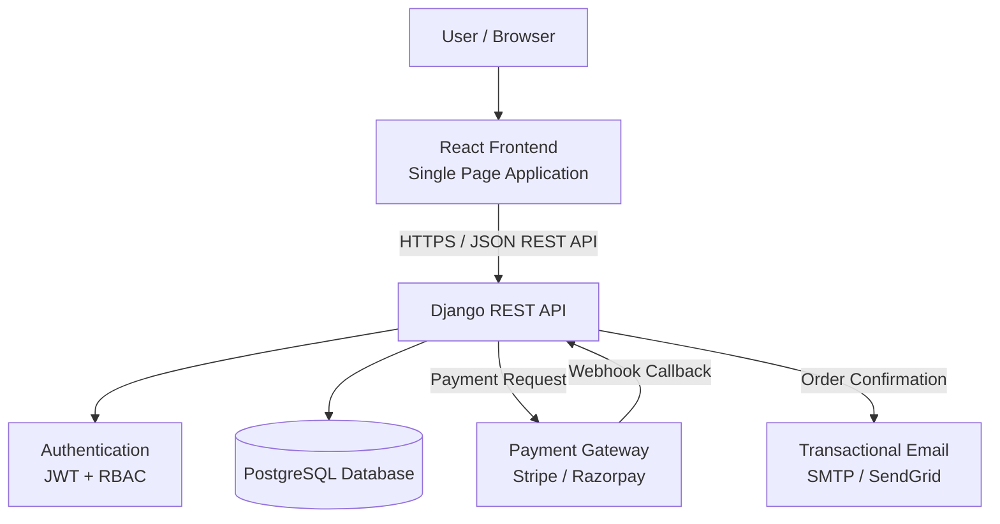

The SRS defines React as the frontend, Django REST Framework as the backend, PostgreSQL as the database, and external payment/email services as integrations.

---

# 🔄 Overall System Flow

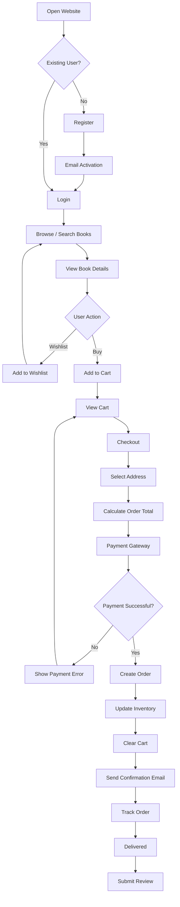

---

# 🔐 Authentication Flow

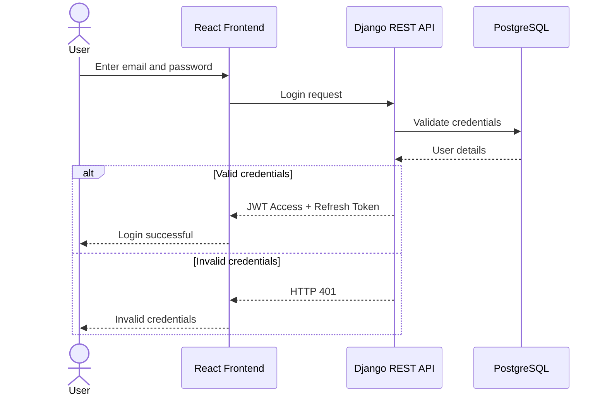

The SRS requires signed JWT access and refresh tokens and specifies HTTP 401 for invalid login credentials.

---

# 🛒 Checkout Flow

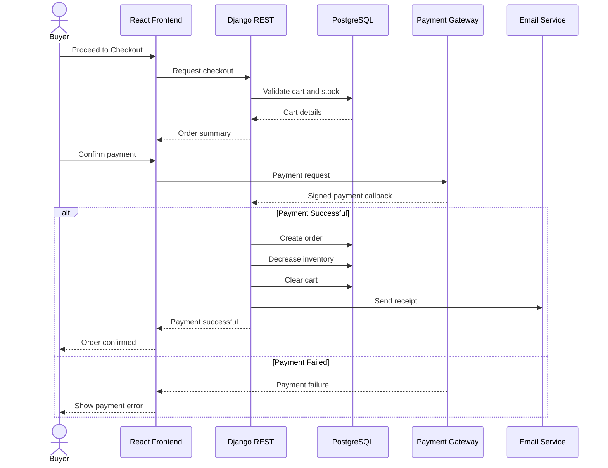

---

# 👥 User Roles

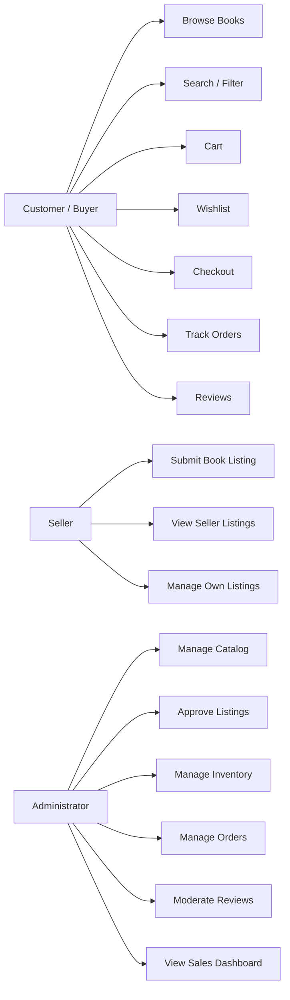

Server-side role-based access control is required so that users cannot access APIs belonging to roles they are not authorized to use.

---

# 🗄️ Database Concept

The system uses **PostgreSQL** as its relational database.

A simplified database relationship can be represented as:

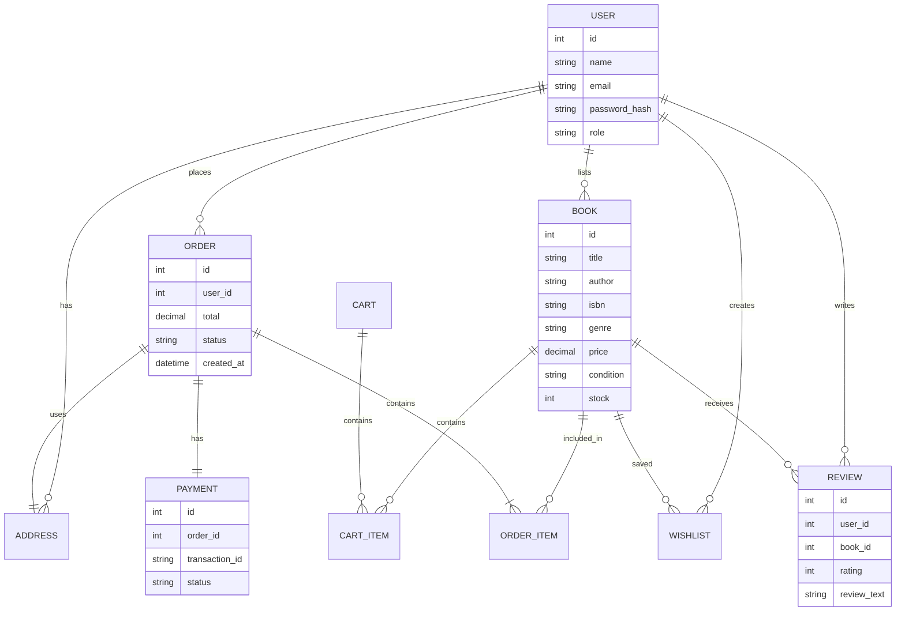

**Note:** This diagram is a conceptual representation of the database entities. The exact final database schema should follow the implementation.

---

# 🔌 API Architecture

The frontend communicates with the Django backend through REST APIs.

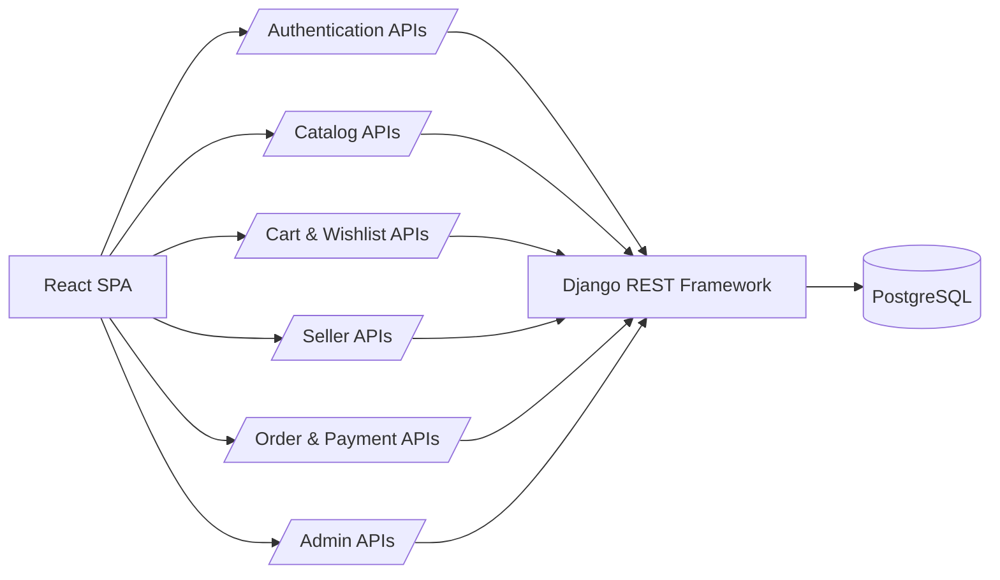

All application communication is designed around secure HTTPS and JSON REST APIs.

---

# 🔒 Security

Security is an important part of the system because it handles user accounts, personal information and payment-related transactions.

## Security Measures

### Password Security

* Passwords are securely hashed.
* Passwords are never stored as plain text.
* Passwords should not appear in application logs.

### HTTPS

The system uses HTTPS for communication between:

```text
React
  ↓
Django REST
  ↓
External Services
```

TLS 1.2 or higher is required.

### JWT Authentication

* Signed JWT tokens
* Short-lived access token
* Refresh token
* Token expiry
* Token revocation after logout

The specified access-token expiry is 15 minutes.

### Role-Based Access Control

```text
Customer
   ├── Customer APIs
   └── Cannot access Admin APIs

Seller
   ├── Seller APIs
   └── Cannot access unauthorized Admin APIs

Admin
   └── Admin APIs
```

### Payment Security

The application does not store raw:

* Card number / PAN
* CVV
* Sensitive card information

Payment information is handled through external PCI-DSS-compliant payment gateways using tokenization.

---

# ⚡ Non-Functional Requirements

The project has the following major quality requirements.

| Requirement                 | Target                                   |
| --------------------------- | ---------------------------------------- |
| API Response Time           | ≤ 2 seconds for 95% of relevant requests |
| Availability                | ≥ 99.5% monthly                          |
| Concurrent Sessions         | At least 500                             |
| Performance Degradation     | ≤ 20%                                    |
| Accessibility               | WCAG 2.1 AA                              |
| Lighthouse UX/Accessibility | > 90/100                                 |
| Audit/Data Retention        | Minimum 3 years                          |
| Order Integrity             | ACID transactions                        |

These requirements are defined in the SRS under BOOK-NF-001 through BOOK-NF-006.

---

# 🧪 Testing

Testing will cover:

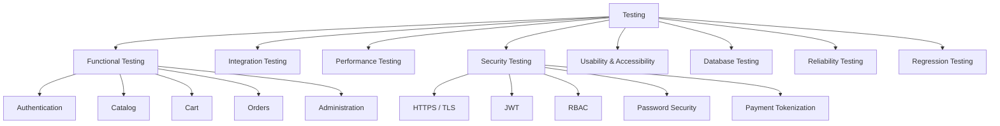

### Testing Tools

| Tool             | Purpose                      |
| ---------------- | ---------------------------- |
| Postman          | API testing                  |
| JMeter           | Load and performance testing |
| Browser DevTools | Frontend and network testing |
| Lighthouse       | Accessibility testing        |
| PostgreSQL Tools | Database validation          |
| Docker           | Environment setup            |
| Git              | Version control              |

---

# 📋 Requirements Traceability

The SRS contains a Requirements Traceability Matrix connecting requirements to test cases.

| Requirement Group | Test Cases              |
| ----------------- | ----------------------- |
| Authentication    | TC-Auth-01 → TC-Auth-05 |
| Catalog           | TC-Cat-01 → TC-Cat-05   |
| Seller            | TC-Sel-01               |
| Orders            | TC-Ord-01 → TC-Ord-05   |
| Administration    | TC-Adm-01 → TC-Adm-04   |
| Performance       | TC-Perf-01 → TC-Perf-02 |
| Reliability       | TC-Rel-01               |
| UI/Accessibility  | TC-UX-01                |
| Data Retention    | TC-Dat-01               |
| Data Integrity    | TC-Int-01               |
| Security          | TC-Sec-01 → TC-Sec-05   |

---

# 📁 Project Structure

A recommended project structure is:

```text
online-bookstore/
│
├── frontend/
│   ├── public/
│   ├── src/
│   │   ├── components/
│   │   ├── pages/
│   │   ├── services/
│   │   ├── hooks/
│   │   ├── context/
│   │   └── App.jsx
│   │
│   ├── package.json
│   └── README.md
│
├── backend/
│   ├── manage.py
│   ├── requirements.txt
│   │
│   ├── bookstore/
│   │   ├── settings.py
│   │   ├── urls.py
│   │   └── wsgi.py
│   │
│   ├── users/
│   ├── books/
│   ├── cart/
│   ├── orders/
│   ├── payments/
│   ├── reviews/
│   └── sellers/
│
├── tests/
│   ├── functional/
│   ├── integration/
│   ├── security/
│   └── performance/
│
├── docs/
│   ├── SRS/
│   ├── TestPlan/
│   └── diagrams/
│
├── docker-compose.yml
├── .env.example
├── .gitignore
└── README.md
```

---

# ⚙️ Technology Stack

| Layer                | Technology            |
| -------------------- | --------------------- |
| Frontend             | React                 |
| Backend              | Django REST Framework |
| Programming Language | Python 3.11+          |
| Database             | PostgreSQL 15+        |
| API                  | REST / JSON           |
| Authentication       | JWT                   |
| Payment              | Stripe / Razorpay     |
| Email                | SMTP / SendGrid       |
| Containerization     | Docker                |
| Deployment           | AWS EC2 / Render      |
| Version Control      | Git                   |

The SRS identifies React, Django REST Framework, PostgreSQL, Docker/Linux infrastructure and Python 3.11+ as the main technical environment.

---

# 🚀 Installation and Setup

## 1. Clone the Repository

```bash
git clone <repository-url>
cd online-bookstore
```

---

## 2. Backend Setup

Create a Python virtual environment:

```bash
python3 -m venv venv
```

Activate it:

### Linux / macOS

```bash
source venv/bin/activate
```

### Windows

```bash
venv\Scripts\activate
```

Install dependencies:

```bash
pip install -r backend/requirements.txt
```

---

## 3. Configure Environment Variables

Create a `.env` file using `.env.example`.

Example:

```env
DEBUG=True

SECRET_KEY=your-secret-key

DB_NAME=bookstore
DB_USER=postgres
DB_PASSWORD=your-password
DB_HOST=localhost
DB_PORT=5432

PAYMENT_GATEWAY_KEY=your-payment-key

EMAIL_HOST=smtp.example.com
EMAIL_PORT=587
EMAIL_USER=your-email
EMAIL_PASSWORD=your-password
```

**Do not commit `.env` to Git.**

---

# 🗄️ Database Setup

Create the PostgreSQL database:

```sql
CREATE DATABASE bookstore;
```

Run migrations:

```bash
python backend/manage.py makemigrations
python backend/manage.py migrate
```

Create an admin user:

```bash
python backend/manage.py createsuperuser
```

---

# ▶️ Running the Backend

```bash
python backend/manage.py runserver
```

The backend will normally be available at:

```text
http://127.0.0.1:8000/
```

For production deployment, HTTPS should be enabled as required by the SRS.

---

# ▶️ Running the Frontend

Move to the frontend directory:

```bash
cd frontend
```

Install dependencies:

```bash
npm install
```

Start the development server:

```bash
npm run dev
```

---

# 🐳 Docker Setup

The project can also be run using Docker.

```bash
docker compose build
docker compose up -d
```

Check running containers:

```bash
docker compose ps
```

Stop the application:

```bash
docker compose down
```

---

# 🔑 Basic User Flow

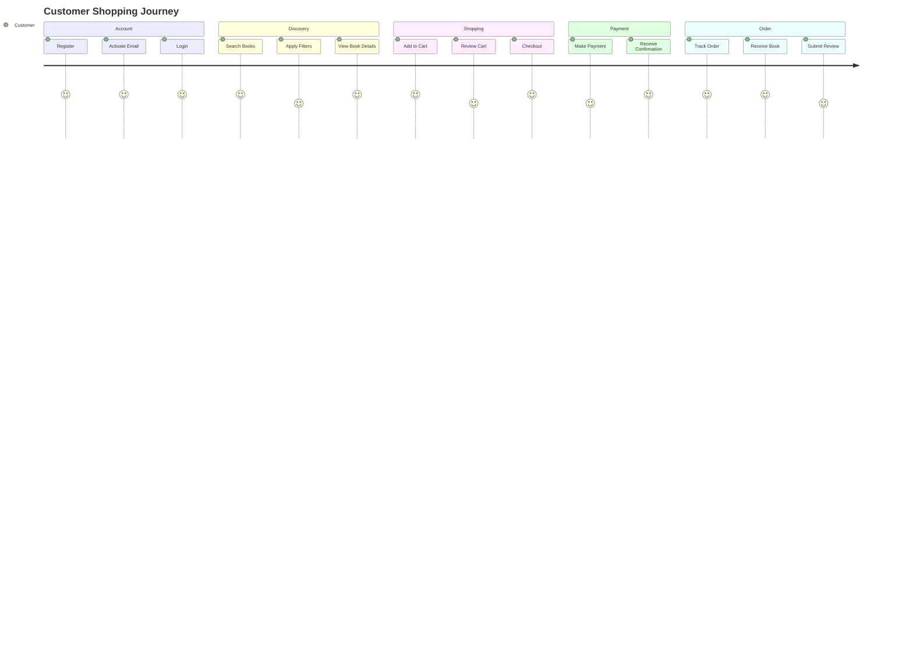

---

# 🏪 Seller Flow

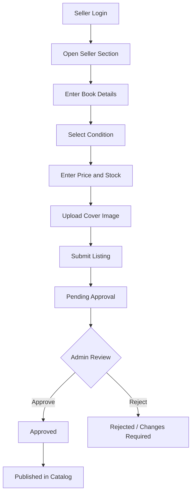

---

# 🛠️ Admin Flow

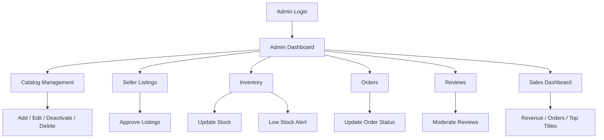

---

# 📊 Quality and Performance

The application is expected to satisfy the following major targets:

```text
API Response
     │
     └── 95% ≤ 2 seconds

Availability
     │
     └── ≥ 99.5% monthly

Concurrent Users
     │
     └── ≥ 500 sessions

Accessibility
     │
     └── WCAG 2.1 AA

Lighthouse
     │
     └── > 90/100
```

The performance, availability, concurrency and accessibility targets are specified in the SRS.

---

# 📜 Project Requirements

### Functional Requirements

The system contains **20 functional requirements**, covering:

* Authentication
* Catalog
* Cart
* Wishlist
* Seller listings
* Checkout
* Payment
* Email
* Orders
* Administration
* Inventory
* Reviews
* Sales dashboard

### Non-Functional Requirements

There are **6 non-functional requirements** covering:

* Performance
* Reliability
* Concurrent users
* Accessibility
* Data retention
* Transaction integrity

### Security Requirements

There are **5 security requirements** covering:

* Password security
* HTTPS/TLS
* JWT security
* RBAC
* Payment tokenization

The SRS defines these requirements and maps them to test cases through the RTM.

---

# 🧪 Acceptance Testing

The project uses five major acceptance test suites:

1. **User Authentication and Access**
2. **Catalog and Search**
3. **Checkout and Payment**
4. **Admin and Fulfillment**
5. **Quality and Performance**

These acceptance areas are defined in the SRS.

---

# 📌 Important Security Notes

Never commit sensitive credentials to GitHub.

Do not commit:

```text
.env
*.pem
*.key
database passwords
API secrets
payment gateway secrets
JWT secrets
```

Use environment variables for sensitive configuration.

Example `.gitignore`:

```gitignore
# Environment
.env
.env.*

# Python
__pycache__/
*.pyc
venv/

# Node
node_modules/
dist/

# Django
db.sqlite3
*.log

# IDE
.vscode/
.idea/

# OS
.DS_Store
Thumbs.db
```

---

# 📚 Documentation

Project documentation should contain:

```text
docs/
│
├── SRS/
│   └── Software Requirements Specification
│
├── TestPlan/
│   └── Software Test Plan
│
└── diagrams/
    ├── architecture
    ├── use-case
    ├── database
    └── system-flow
```

---

# 👨‍💻 Team

| Name                | USN           |
| ------------------- | ------------- |
| PRUTHVIRAJ H        | PES2UG24CS381 |
| PUNEET LINGASHETTAR | PES2UG24CS382 |
| PUNITH K            | PES2UG24CS383 |
| PURVITHA MACHIREDDY | PES2UG24CS384 |

**Team:** Team 4

---

# 📄 Project Documents

| Document             | Description                                |
| -------------------- | ------------------------------------------ |
| SRS                  | Software Requirements Specification        |
| Test Plan            | Software testing strategy and traceability |
| RTM                  | Requirements Traceability Matrix           |
| Use Case Diagram     | User-system interactions                   |
| Architecture Diagram | System components and communication        |
| Database Design      | Data and relationships                     |

---

# 📜 License

This project is developed as an **academic Software Engineering mini-project**.

It is intended for educational and demonstration purposes.

---

# 🙌 Acknowledgement

This project was developed as part of the Software Engineering coursework. The system design, requirements and testing approach are based on the project's Software Requirements Specification.

---

# ⭐ Summary

The **Online Bookstore System** provides a complete platform for buying and selling books through a web application.

```text
                    ONLINE BOOKSTORE
                           │
          ┌────────────────┼────────────────┐
          │                │                │
       CUSTOMER          SELLER           ADMIN
          │                │                │
      Browse Books     List Books       Manage Catalog
      Search           Submit Listing   Manage Inventory
      Cart             View Listing     Manage Orders
      Wishlist         ────────►        Moderate Reviews
      Checkout                          Sales Dashboard
      Payment
      Orders
      Reviews
```

The application combines a **React frontend, Django REST backend and PostgreSQL database**, with external services for payment and transactional email. The system is designed with authentication, role-based authorization, transaction integrity, performance and security as important parts of the overall implementation.

---

**Project:** Online Bookstore System – Buying & Selling Platform
**Version:** 1.0
**Team:** Team 4
**Academic Year:** 2026
